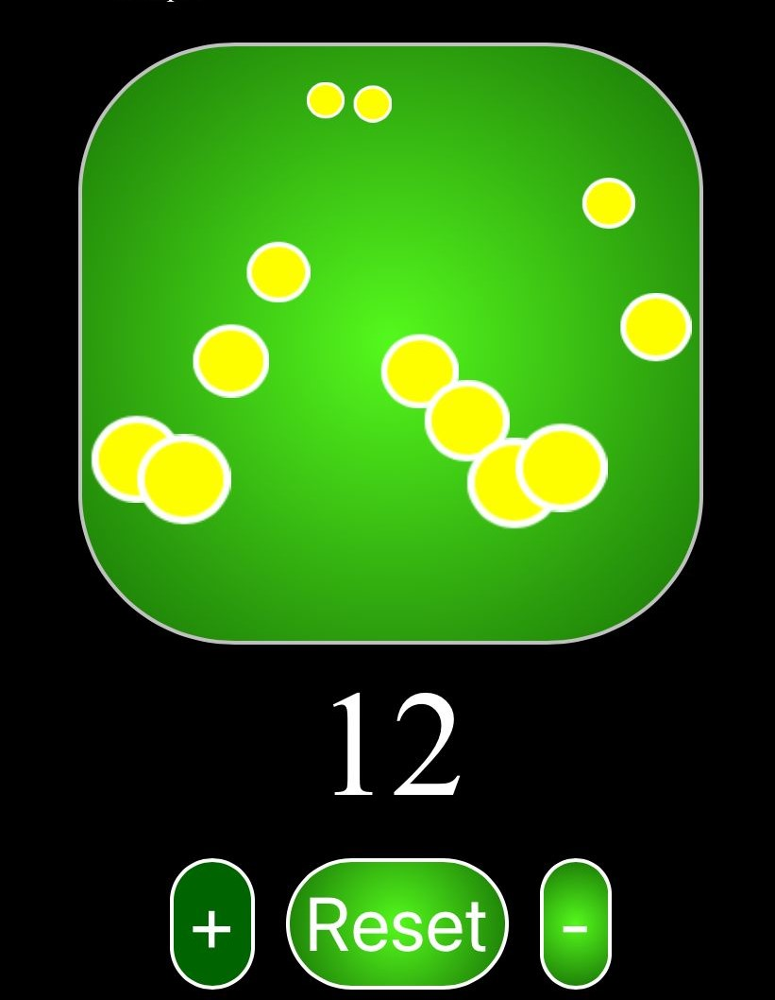

# **Balls-Counter**

### About The Project

---

### Built With

- [HTML](https://www.w3schools.com/html/html_intro.asp)
- [CSS](https://www.w3schools.com/css/css_intro.asp)
- [Javascript](https://www.javascript.com/)

---

### Usage

The project is based on a counter app.
You can modify the value of the counter using the + and - buttons.
You can restart the counter value using the restart button.
 
 
- To test the app ==>
_[follow this link](https://balls-counter.netlify.app/)_

---

### Contact

William - verga.william.95@gmail.com

Project Link: [https://github.com/William-95/balls-counter.github.io](https://github.com/William-95/balls-counter.github.io)
